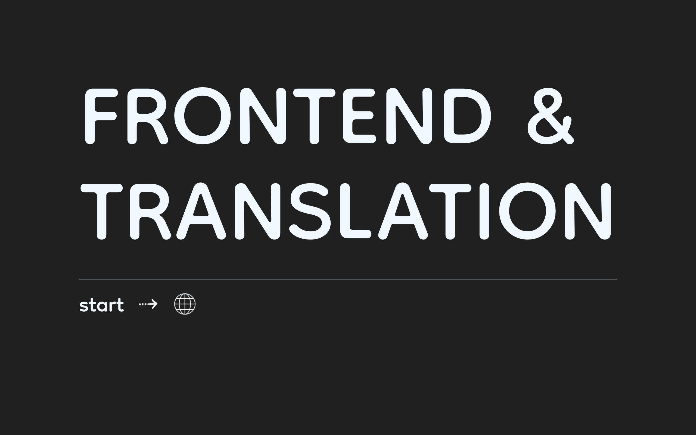
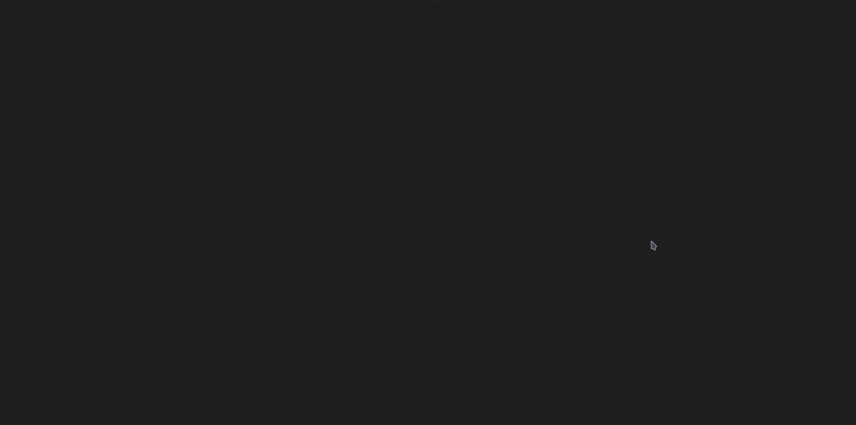
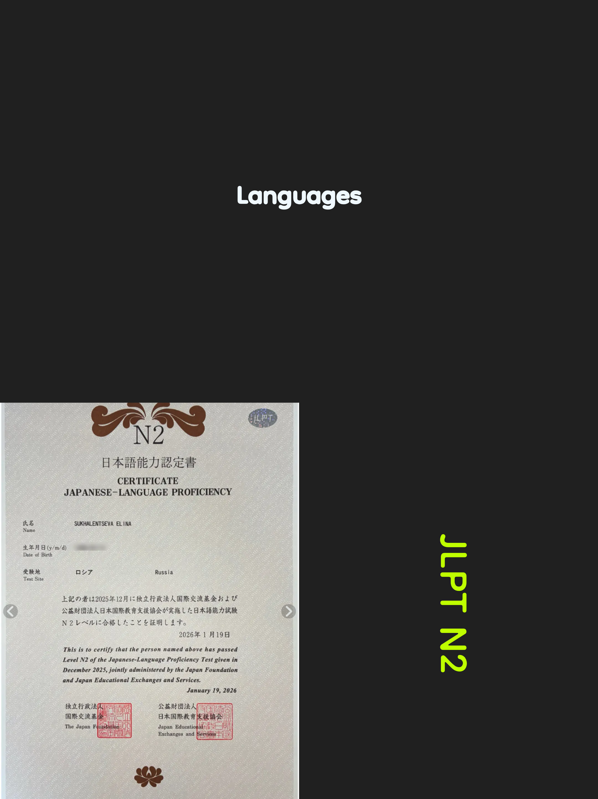
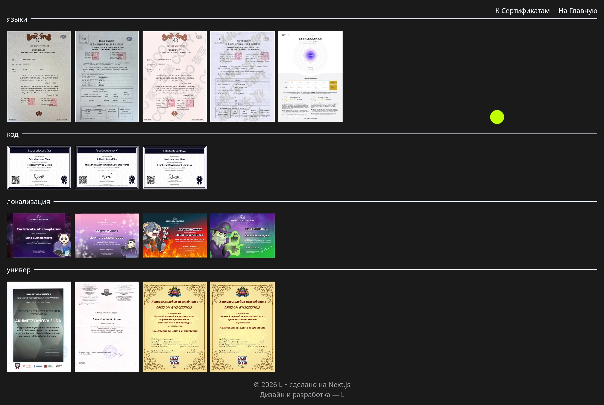

<h1 align=center>  Portfolio 2026  </h1>

<div align="left">
  
  
  
  
  
  
  

</div>

## 📋 Project Overview
My personal portfolio website built with Next.js, showcasing my projects and skills as a Frontend Developer & Translator.

> **Note for Japanese Recruiters**:  
> 日本語の説明が必要な場合は、[日本語版README](README.ja.md)をご覧ください。  
> 翻訳の経験を活かした国際化対応が得意です。


🔗 **Live Site:** [shigoto-el-portfolio.vercel.app](https://shigoto-el-portfolio.vercel.app)

<details>
<summary>Project Images</summary>

| Pages | Images |
|:-------:|:----------:|
| **Front Page** |  |
| **Main Page** | |
| **Certificate Page** |  | 
| **All Certificate Page** |  | 
</details>


## Key Features

- **Multilingual:** Full internationalization (EN/RU/JA) using `next-intl`
- **Modern Animations:** Smooth micro-interactions with [Motion](https://motion.dev/) (prev Framer Motion)
- **Responsive:** Optimized for all device sizes
- **Performance:** Built with Next.js 16 and React 19 for optimal speed
- **Accessibility:** Semantic HTML and keyboard navigation support

## Tech Stack

- **Framework:** Next.js 16, React 19
- **Language:** TypeScript 5
- **Styling:** Tailwind CSS 4
- **i18n:** next-intl
- **Deployment:** Vercel

### Additional tools used
- **Canvas Confetti** - Celebration effects on achievements
- **Sound Feedback** - Interactive audio cues using `use-sound`
- **Image Optimization** - Sharp for performant images
- **Interactive Games** - "FactsGame" in About section with collectibles
- **Custom Cursor** - Dynamic cursor effects
- **Responsive Design** - Optimized for all screen sizes

## Project Structure 

```
portfolio2026/
├── app/ # Next.js App Router
│ ├── [locale]/             # Internationalized routes (EN/RU/JA)
│ │ ├── certificates/       # Certificates showcase
│ │ ├── main/               # Main portfolio page
│ │ └── page.tsx            # Landing page
│ ├── components/           # All React components
│ │ ├── animations/         # Custom motion components
│ │ ├── AboutSection/       # About page with FactsGame
│ │ ├── ProjectsSection/    # Project cards with hover effects
│ │ └── ...
│ ├── data/                 # JSON data files
│ ├── hooks/                # Custom hooks (useCurrentLang)
│ └── utils/                # Utilities & interfaces
├── i18n/                   # Internationalization config
├── messages/               # Translation files (EN/RU/JA)
├── public/                 # Static assets
│ ├── images/               # All images organized by section
│ └── sounds/               # Sound effects for interactions
└── package.json            # Dependencies listed above
```